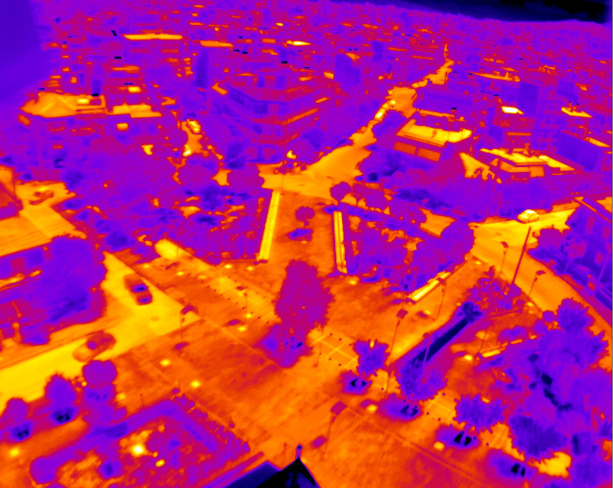

# INF250: Mandatory Exercise 2

---

By Kristian Gunder Kramås  
Fall 2020  

---

We'll sharpen and edge detect this image:



## ✅ TODO

The following is my interpretation of the exercise:

- [ ] Write edge detection function
  - [ ] Input
    - [ ] Image (np.ndarray)
    - [ ] Edge operator (string, `prewitt`, `sobel` or `canny`)
  - [ ] Logic
    - [ ] Apply ONE edge operator 
      - [ ] Prewitt
      - [ ] Sobel  
      - [ ] Canny
  - [ ] Output
    - [ ] Image (with edge detection)
- [ ] Write image sharpening function
  - [ ] Input
    - [ ] Image (np.ndarray)
    - [ ] Method (string, `la_place` or `usm`)
  - [ ] Logic
    - [ ] Sharpen image
      - [ ] La Place filter
      - [ ] Unsharpening mask (USM)  
  - [ ] Output
    - [ ] Image (with edge detection)
- [ ] Make function to export PNG-images of all functions with all parameters
- [ ] Write report in Word or Latex (as this seems arbitrary, I'll assume it's okay to use plain [Markdown](https://www.markdownguide.org/))
  - [ ] Describe images and rate sharpening
    - [ ] Edge detection
    - [ ] Sharpening
  - [ ] Include python program
- [ ] Convert MD to PDF (for submission)

## ✨ Results

### Images

### Discussion

## 👨‍💻 Code

```python
# Paste code here when done
```

## 💬 Comments

- Python script is auto-formatted by black with a custom line length of 79

    To enable in VSCode, install black

    ```shell
    pip install black
    ```

    Add this to your `settings.json`

    ```JSON
    "editor.formatOnSave": true,
    "python.formatting.provider": "black",
    "python.formatting.blackArgs": ["-l", "79"],
    ```

    Say yes to any prompts the next time you save a Python file
