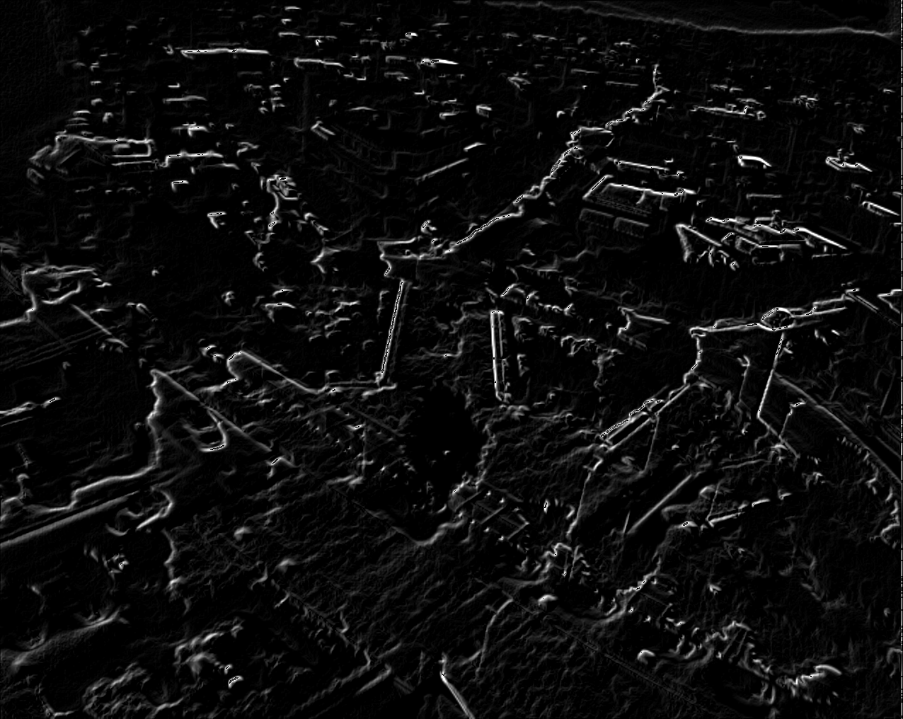

# INF250: Mandatory Exercise 2

---

By Kristian Gunder Kramås  
Fall 2020  
[GitHub Repository](https://github.com/VidunderGunder/inf250-mandatory-assignment-2)

---

We'll sharpen and edge detect this image:


## ✅ TODO

The following is my interpretation of the exercise:

- [x] Write edge detection function
  - [x] Input
    - [x] Image (np.ndarray)
    - [x] Edge operator (string, `prewitt`, `sobel` or `canny`)
  - [x] Logic
    - [x] Apply ONE edge operator 
      - [x] Prewitt
      - [x] Sobel  
      - [x] Canny
  - [x] Output
    - [x] Image (with edge detection)
- [x] Write image sharpening function
  - [x] Input
    - [x] Image (np.ndarray)
    - [x] Method (string, `la_place` or `usm`)
  - [x] Logic
    - [x] Sharpen image
      - [x] La Place filter
      - [x] Unsharpening mask (USM)  
  - [x] Output
    - [x] Image (with edge detection)
- [x] Make function to export PNG-images of all functions with all parameters
- [x] Write report in Word or Latex (as this seems arbitrary, I'll assume it's okay to use plain [Markdown](https://www.markdownguide.org/))
  - [x] Attach images
  - [x] Describe images and rate ~~sharpening~~ edge detection
    - [x] Edge detection algorithms
    - [x] Sharpening algorithms
  - [x] Include python program
- [x] Convert MD to PDF (for submission)

## 👨‍💻 Code

### Setup

Use a virtual environment if you like to follow best practices. I won't.

```shell
pip install -r requirements.txt
```

### Python program

```python
# -*- coding: utf-8 -*-

"""
INF250 Mandatory assignment 2

Sharpening and edge detection

See: https://github.com/VidunderGunder/inf250-mandatory-assignment-2
"""

__author__ = "Kristian Gunder Kramås"
__email__ = "kristiankramas@outlook.com"

from cv2 import cv2
import numpy as np
import os


def detect_edges(img, edge_operator="prewitt"):
    """
    Returns the result from one of the edge operators,
    prewitt, sobel or canny

    Based on:
        https://gist.github.com/rahit/c078cabc0a48f2570028bff397a9e154
        https://docs.opencv.org/master/da/d22/tutorial_py_canny.html

    Parameters:
    -----------
    img : np.ndarray
        Image to detect blobs in
    operator : string
        "prewitt", "canny" or "laplace"
        Defaults to "prewitt"

    Returns:
    --------
    output : np.ndarray(np.uint)
        Resulting image from the edge operator
        or given image if invalid edge operator
    """

    # Blurred version of the image, to reduce noise and facilitate
    # spotting actual edges as generally recommended by OpenCV, e.g.:
    # https://opencv-python-tutroals.readthedocs.io/en/latest/py_tutorials/py_imgproc/py_canny/py_canny.html
    img_gaussian = cv2.GaussianBlur(img, (3, 3), 0)

    # Functions to use in switch
    def prewitt():
        kernelx = np.array([[1, 1, 1], [0, 0, 0], [-1, -1, -1]])
        kernely = np.array([[-1, 0, 1], [-1, 0, 1], [-1, 0, 1]])
        return cv2.filter2D(img_gaussian, -1, kernelx) + cv2.filter2D(
            img_gaussian, -1, kernely
        )

    def sobel():
        img_sobelx = cv2.Sobel(img_gaussian, cv2.CV_8U, 1, 0, ksize=3)
        img_sobely = cv2.Sobel(img_gaussian, cv2.CV_8U, 0, 1, ksize=3)
        return img_sobelx + img_sobely

    def canny():
        return cv2.Canny(img, threshold1=50, threshold2=90)

    # Switch
    # Returns original image if no valid edge operator
    return {
        "prewitt": prewitt(),
        "sobel": sobel(),
        "canny": canny(),
    }.get(edge_operator.lower(), img)


def sharpen(img, method="la_place"):
    """
    Performs an image sharpening using laplace filter or unsharpen mask (USM)

    Based on:
        https://docs.opencv.org/3.4/d5/db5/tutorial_laplace_operator.html
        https://stackoverflow.com/questions/4993082/how-can-i-sharpen-an-image-in-opencv (top answer as of 10.11.2020)

    Parameters:
    -----------
    img : np.ndarray
        Image to sharpen.
    operator : string
        "la_place" or "usm"
        Defaults to "la_place"

    Returns:
    --------
    output : np.ndarray(np.uint)
        Resulting image from the given method
        or given image if invalid method
    """

    # Functions to use in switch
    def la_place():
        dst = cv2.Laplacian(img, cv2.CV_16S, ksize=3)
        return cv2.convertScaleAbs(dst)

    def usm():
        img2 = cv2.GaussianBlur(img, (0, 0), 2.0)
        return cv2.addWeighted(img, 1, img2, -0.5, 0, img)

    # Switch
    # Returns original image if no valid edge operator
    return {
        "la_place": la_place(),
        "usm": usm(),
    }.get(method.lower(), img)


def export(img, name):
    """
    Exports image to output directory

    Parameters:
    -----------
    img : np.ndarray
        Image to export
    name : string
        Filename
    """
    output_dir = "./output"

    if not os.path.exists(output_dir):
        os.makedirs(output_dir)

    cv2.imwrite(f"{output_dir}/{name}.png", img)


def show(img, name):
    """
    Shows image

    Parameters:
    -----------
    img : np.ndarray
        Image to show
    name : string
        Header
    """
    cv2.imshow(name, img)
    input("Press enter to continue")


if __name__ == "__main__":
    img_path = "./AthenIR.png"
    img = cv2.imread(img_path, cv2.IMREAD_GRAYSCALE)

    edge_operators = [
        "prewitt",
        "sobel",
        "canny",
    ]

    methods = [
        "la_place",
        "usm",
    ]

    for operator in edge_operators:
        result = detect_edges(img, operator)
        export(result, operator)

    for method in methods:
        result = sharpen(img, method)
        export(result, method)
```

Parameter tuning was done manually within the functions, with images open (updated between changes).

## ✨ Results

### Images

I spent *some* time tuning the parameters to get the best result for each operator/method, but this could obviously be done more thoroughly. 

#### Edge detection

<table>
  <tr>
    <th>prewitt</th>
    <th>sobel</th>
    <th>canny</th>
  </tr>
  <tr>
    <td></td>
    <td></td>
    <td></td>
  </tr>
</table>

#### Sharpening

<table>
  <tr>
    <th>la_place</th>
    <th>usm</th>
  </tr>
  <tr>
    <td></td>
    <td></td>
  </tr>
</table>

### Discussion

_Note: I assume the assignment wants us to discuss edge detection, as discussing sharpness seems a bit out of place when looking at the resulting images from all methods/operators (both functions), except USM._

_Also, it is not clear for what purpose the sharpening will be used (aesthetics, image analysis, clarity for inspection by humans etc.), so it is hard to know what could be considered "best"._

_I will discuss the performance of edge detection for use in image analysis where object detection is the goal below:_

- There was not a huge difference between results using a small amount of gaussian blur or not in my testing, but it did filter out some irrelevant details that is not considered the edge of an object.
- Canny gives us a binary result of wether something is a edge or not. It can be used as for crude edge detection, but a lot of detail and information is lost, and it is hard to process further
- Prewitt, Sobel and Laplace (with the current config) gives us more of a probability of something being an edge and will need further processing if we need a binary result. This approach retains much information, and the resulting image is comprehensible for humans.   
- USM with the current config is basically useless for edge detection. As OpenCV recommends blurring images for edge detection, I don't see how it could be used in conjunction with the other algorithms to perform better edge detection either.

### Best performer

To my eyes and with my parameter tweaking, Laplace seems the most suited for edge detection.

## 🐐 Miscellaneous

- Python script is auto-formatted by black with a custom line length of 79

    To enable in VSCode, install black

    ```shell
    pip install black
    ```

    Add this to your `settings.json`

    ```JSON
    "editor.formatOnSave": true,
    "python.formatting.provider": "black",
    "python.formatting.blackArgs": ["-l", "79"],
    ```

    Say yes to any prompts the next time you save a Python file

- Exported using `grip`:

    ```shell
    pip install grip
    grip './README.md'
    ```

    Save as PDF using browser print.
